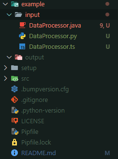
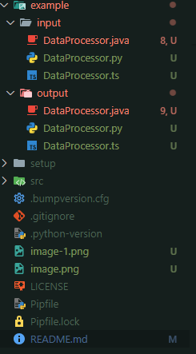

# Infusion

A CLI tool for generating documentation for source code using advanced language models.

## Table of Contents
- [Description](#description)
- [Installation](#installation)
- [Usage](#usage)
- [Practical example](#practical-example)
- [Options](#options)
- [Features](#features)
- [License](#license)

## Description

Infusion is a command-line tool designed to assist developers by generating documentation for their source code. By providing file paths, Infusion leverages language models like OpenAI’s GPT to modify the files by inserting appropriate comments and documentation. The tool supports multiple programming languages.

It is particularly useful when you need structured comments (e.g., JSDoc for JavaScript/TypeScript or JavaDoc for Java) or simple comments above functions and classes. Infusion saves the modified files to a specified output directory.

## Installation

To install and run Infusion locally, clone the GitHub repository.

```bash
git clone https://github.com/your-username/infusion.git
cd infusion
```

After that, you will have to set up a virtual environment and install all the dependencies. 

If you are on **Windows**, use **PowerShell** to set up virtual environemnt using the command:
```powershell
./setup/setup.ps1
```

If you are on **Mac / Linux**, use the following command:
```bash
./setup/setup.sh
```

After you are done setting up virtual environment, you can use the Infusion tool by running:
```bash
pipenv run infsue [OPTIONS] [FILE_PATHS]...
```

## Usage

To use Infusion, run the following command, replacing FILE_PATHS with the paths to the source code files you want to process.

Process a single file:
```bash
pipenv run infsue ./path/to/source.py
```

Process a single file and specify an output folder:
```bash
pipenv run infsue ./path/to/source.py --output my_output_folder
```

Process multiple files:
```bash
pipenv run infsue ./file1.js ./file2.py
```

Process multiple files without specifying every single one of them:
```bash
pipenv run infsue ./folder/*
```

Process multiple files and specify an output folder to save files to instead of printing them to stdout:
```bash
pipenv run infsue ./file1.js ./file2.py --output my_output_folder
```

## Practical example

`example` inside of the root directory contains three input files in different languages. 



You can see that these files contain little to no documentation. We take these files and ask LLM to add documentation to them. To do that, we will write the following command. 

```bash
pipenv run infsue ./example/input/DataProcessor.java ./example/input/DataProcessor.py ./example/input/DataProcessor.ts --output ./example/output
```
This command assumes that you are inside of root of Infusion tool. If you are not, make sure to adjust the paths or change your current directory to the root.
What we've done above is specified paths to the files which we want to be documented and a path to the folder, where we want to store the results.

Once you execute the command above, you will be asked to provide your openAI key:
```bash
Open AI API key:
```
It won't be seen for security purposes.

You can read about obtaining them [here](https://community.openai.com/t/how-to-generate-openai-api-key/401363).

If you don't want to define your API key every time you execute the tool, you can also provide it inside of .env file in the root folder. You can look for the expected structure of .env file in the .env.example file in the root. 

After we have entered open AI API key, the processing will begin, and after a few seconds we will 3 new files inside of `./example/output/` folder containing 3 files with generated documentation. 

Console output:


Folder structure after Infusion executed:



## Options
- `-v, --version`: Show the current version of the tool and exit.
- `-o, --output`: Specify an output folder for files with generated documentation. If not provided, the output will be shown in stdout, and won't be saved to any file.
- `-m, --model`: Select the Open AI model to use when generating documentation. Defaults to `gpt-4o`. Available values: `gpt-4o`, `gpt-4o-mini`.
- `-h, --help`: Show the help message with usage details and exit.
- `-u, --token-usage`: Show the number of tokens that were sent in the prompt and returned in the response.

## Features
- Automatically generates structured comments and documentation for source code.
- Supports multiple programming languages (identified via file extension).
- Handles multiple files at once (no batch processing yet).
- Allows custom output directories to store the processed files.

## License
This project is licensed under the MIT License - see the `LICENSE` file for details.
